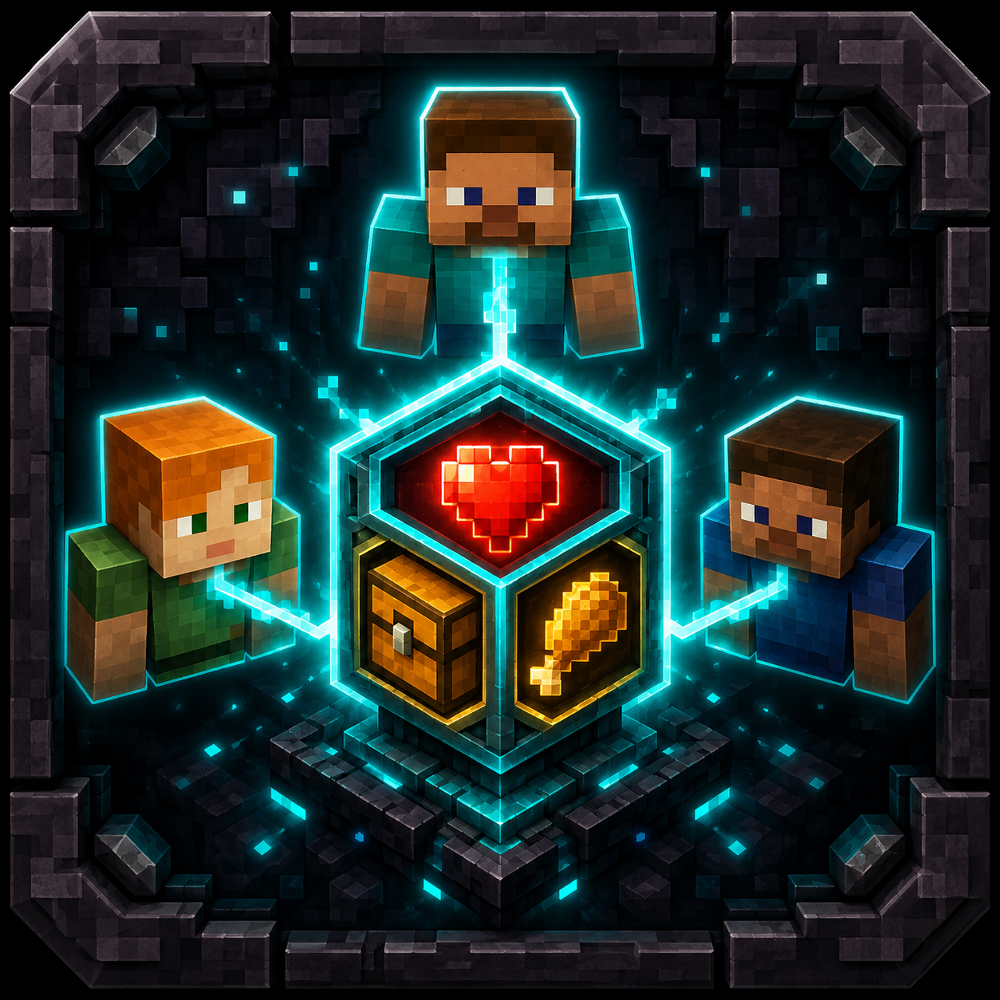

<p align="center">
  
</p>

# CloneCraft

A Minecraft Bedrock Edition addon built with the Script API (TypeScript).

## Features

- Shared health system across players
- Death synchronization
- Inventory persistence
- Admin commands via `/scriptevent`

## Prerequisites

- Node.js 18+
- Minecraft Bedrock Edition (1.26.33+)

## Setup

```bash
npm install
npm run build
```

## Commands

| Command | Description |
|---------|-------------|
| `npm run build` | Build TypeScript to JavaScript |
| `npm run typecheck` | Type-check without emitting |
| `npm run deploy:dev` | Build and deploy to Minecraft dev folder |
| `npm run bundle` | Create `.mcaddon` for distribution |

## Script Commands

Send these via `/scriptevent` in-game:

| Command | Description |
|---------|-------------|
| `clonecraft:enable` | Enable the addon |
| `clonecraft:disable` | Disable the addon |
| `clonecraft:resync` | Force resync all players |
| `clonecraft:status` | Show current state |
| `clonecraft:save` | Save state immediately |
| `clonecraft:reset` | Reset from first eligible player |
| `clonecraft:set_health <value>` | Set shared health (0-1024) |

## License

MIT
